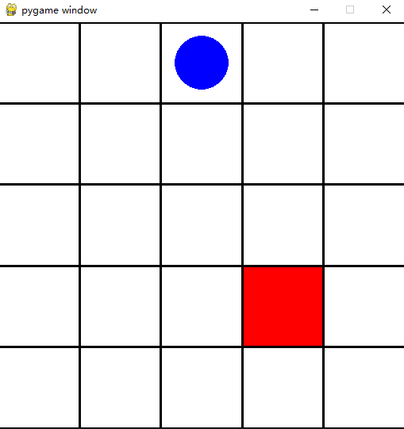

# sb3_practice
Long-term collection of RL practice based on Stable Baselines 3.

Lastest version of SB3: [Installation](https://stable-baselines3.readthedocs.io/en/master/guide/install.html).

## Gridworld by PPO
Gridworld is modified from a custom Gym enviroment ([Link](https://gymnasium.farama.org/tutorials/gymnasium_basics/environment_creation/)).
Episode ends when the agent reaches the destination.

| Performance | Description |
| :---------: | :---------: |
|  | Random step |
|  | PPO agent |

