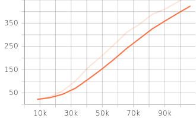
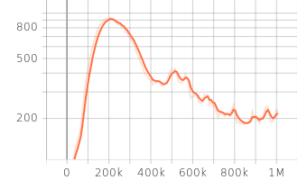
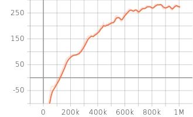
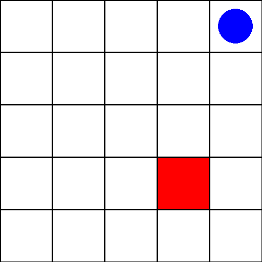
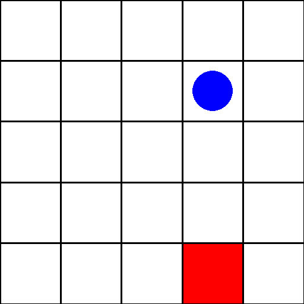
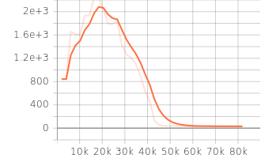
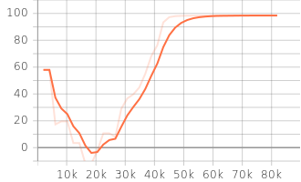
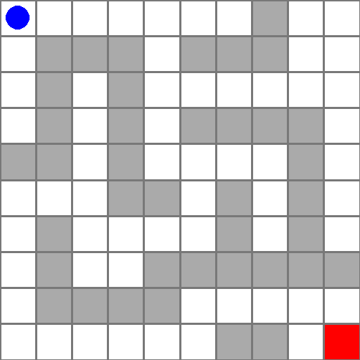
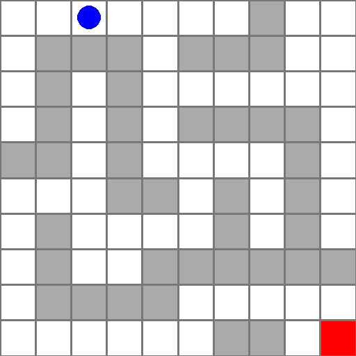
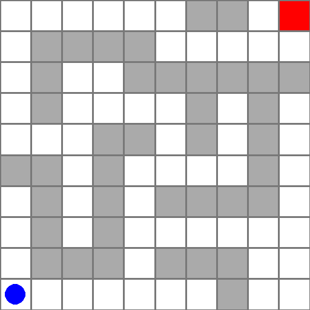

# SB3_practice
Long-term collection of RL practice in the framework of Stable Baselines 3. 
I will make sure that each example is not the same, each has different processing details
(except "hello world" enviroments: Cartpole and Lunarlander).

Lastest version of SB3: [Installation](https://stable-baselines3.readthedocs.io/en/master/guide/install.html).

Experimental features based on SB3: [SB3 Contrib](https://stable-baselines3.readthedocs.io/en/master/guide/sb3_contrib.html).

Anything about Gym enviroment: [Gym Documentation](https://www.gymlibrary.dev/).

## Cartpole by PPO
Cartpole is a classical Gym enviroment (for details see [here](https://gymnasium.farama.org/environments/classic_control/cart_pole/)).

See codes [here](https://github.com/wwsyan/sb3_practice/tree/main/cartpole_ppo).

### Log
| Episode length | Episode reward |
| :---------: | :---------: |
|  |  |

## Lunarlander by PPO
Lunarlander is a classical Gym enviroment, aiming at rocket trajectory optimization 
(for details see [here](https://gymnasium.farama.org/environments/box2d/lunar_lander/)).

See codes [here](https://github.com/wwsyan/sb3_practice/tree/main/lunarlander_ppo).

### Log
| Episode length | Episode reward |
| :---------: | :---------: |
|  |  |

## Gridworld by PPO
Gridworld is modified from a custom Gym enviroment (for details see [here](https://gymnasium.farama.org/tutorials/gymnasium_basics/environment_creation/)),
where an episode ends when the agent reaches the destination.

See codes [here](https://github.com/wwsyan/sb3_practice/tree/main/gridworld_ppo).

### Video
| Random step | PPO agent |
| :---------: | :---------: |
|  |  |

## Maze by maskable PPO
Maze is a 2d gridworld-like enviroment.
<ul>
<li>Masking invalid actions greatly speeds up the training process of neural network. </li>
<li>1d observation is applied though it's natural to use a image-like observation.
The reason is, SB3 <code>CnnPolicy</code> require image data to have a minimum size of 36x36.
Lukily, a flattened observation still works well. </li>
</ul>

See codes [here](https://github.com/wwsyan/sb3_practice/tree/main/maze_ppo).

### Log
| Episode length | Episode reward |
| :---------: | :---------: |
|  |  |

### Video
| Random step | PPO agent |
| :---------: | :---------: |
|  |  |

## Maze by maskable PPO with Data Augment
Can the agent make correct decisions if the evaluation environment is different from the training environment?
Applying data augment in training may help.
In this case, the evaluation enviroment is a **symmetric equivalent** transformation of the training enviroment.
An easy idea is generating equivalent batch datas based on the original batch data.

In order to achieve this goal, I build a custom callback and handle the rollout buffer data directly
(See how to customize callback [here](https://stable-baselines3.readthedocs.io/en/master/guide/callbacks.html)) .
We need to handle 9 kinds of data:
<ul>
  <li>Expand <code>observations</code>, <code>actions</code> and <code>action_masks</code>.</li>
  <li>Share <code>episode_starts</code> and <code>rewards</code>.</li>
  <li>Recompute <code>values</code> and <code>log_probs</code>.</li>
  <li>Recompute <code>returns</code> and <code>advantages</code>.</li>
</ul>

See codes [here](https://github.com/wwsyan/sb3_practice/tree/main/maze_ppo_da).

### Video
| Training enviroment | Evaluation enviroment |
| :---------: | :---------: |
|  |  |

Something interesting is, while the agent performed perfectly in the training environment, it got **stuck** in the evaluation environment.
**KL divergence** explains this, large value of `approx_kl` seems to indicate that the network is not fully fitted:

| total_steps = 8e4| total_steps = 15e4 |
| :---: | :---: |
| approx_kl = 2.1942 |  approx_kl = 0.1253 |
|  |  |

